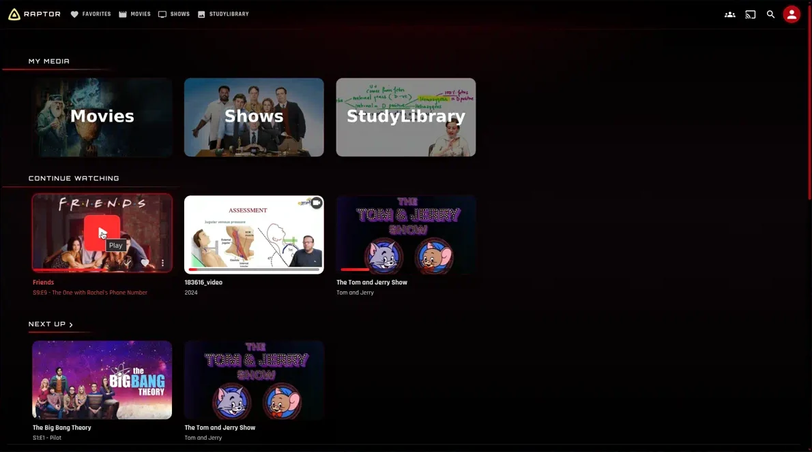
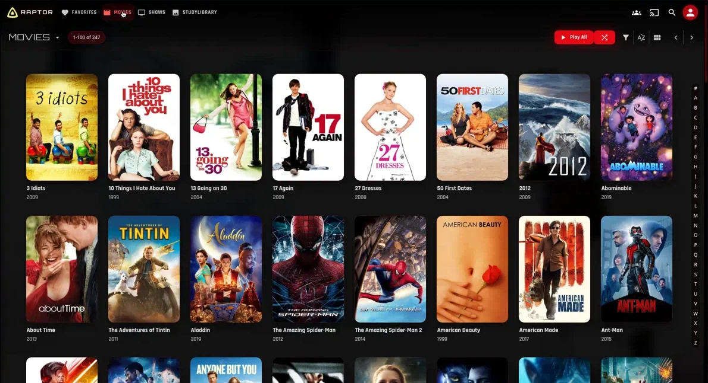
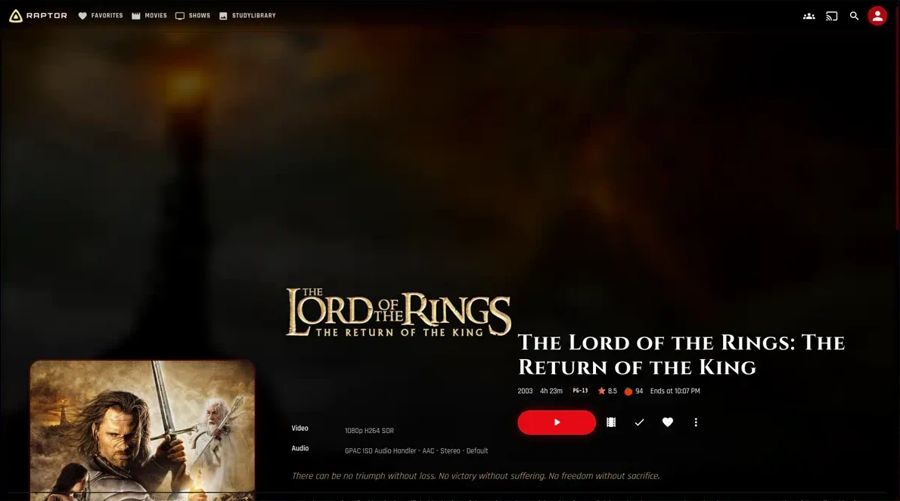
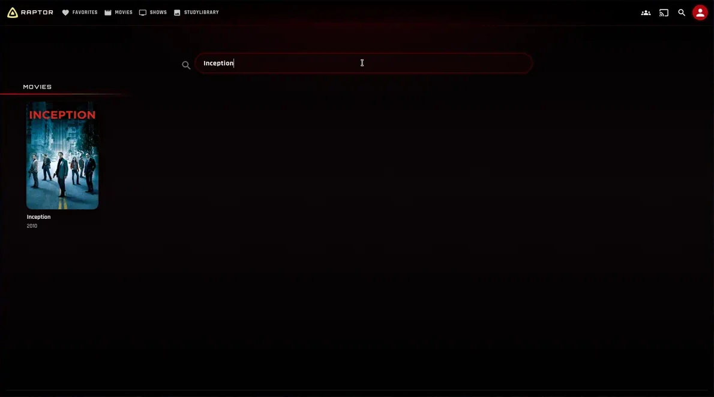
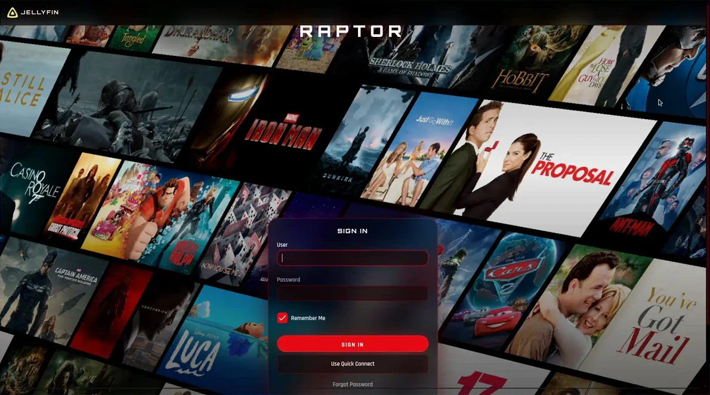
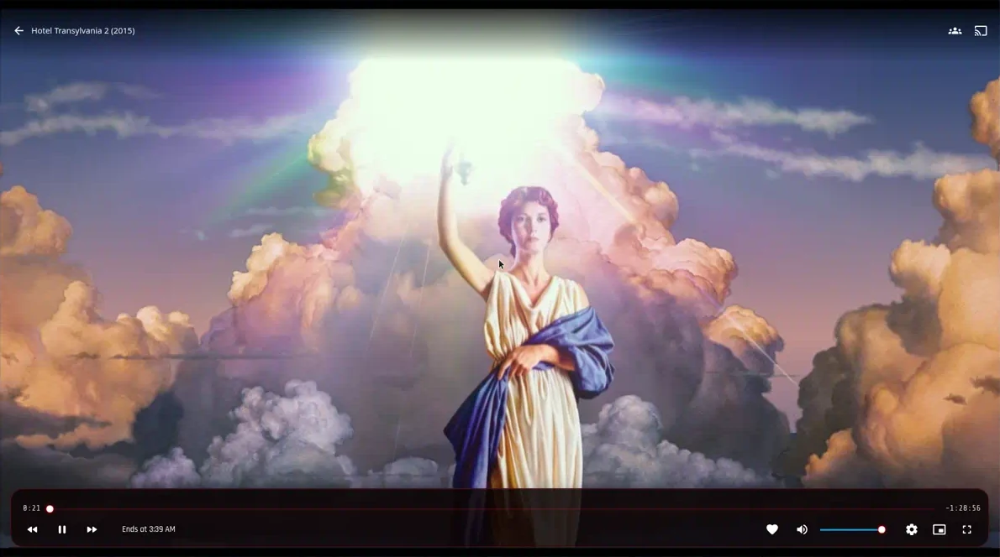
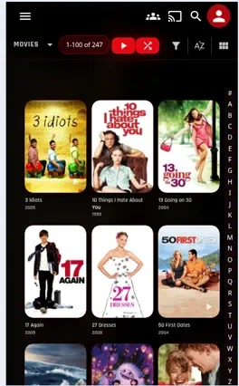

# Finflix

**Source theme:** [Abyss Net](https://github.com/AumGupta/abyss-jellyfin) — [Abyss for Jellyfin](https://aumgupta.github.io/abyss-jellyfin/) by Om Gupta.

Finflix is a cinematic, Netflix-red skin for **Jellyfin 12** (React / MUI web UI), with fallbacks for the legacy web client and Jellyfin Media Player. It keeps Abyss’s thorough restyle — glass surfaces, motion, and a full-pass over chrome — and reworks the palette, type, login, player, and library into an OLED streaming look.

[](https://jellyfin.org)
[](./LICENSE)

[Install](#install) · [Customize](#customize) · [Gallery](#gallery) · [Videos](#videos)

<p>
  <a href="docs/videos/home-movies-detail.mp4"></a>
</p>

## Install

Finflix is **custom CSS**. It does not replace the Jellyfin server.

1. Set **Settings → Display → Theme** to **Dark**.
2. Turn **Backdrops** on (Settings → Display).
3. Open **Dashboard → Branding → Custom CSS code**  
   (or **Settings → Display → Custom CSS** for one user).
4. Paste **either** the one-line import **or** the full [`finflix.css`](./finflix.css) file (`style.css` is the same sheet, kept as an alias).
5. Save, then hard-refresh the web client (`Ctrl` / `Cmd` + `Shift` + `R`).

One-line import (after this repo’s default branch has `finflix.css`):

```css
@import url("https://cdn.jsdelivr.net/gh/dallergy/Finflix@main/finflix.css");
```

Jellyfin **10.11+** does not load custom CSS on the **admin dashboard**. That is a server security choice, not a theme bug. User-facing pages (home, libraries, detail, player, login) do load it.

More detail: [`docs/INSTALL.md`](./docs/INSTALL.md).

## Customize

Put overrides **after** the `@import` (or at the top of a pasted file).

```css
@import url("https://cdn.jsdelivr.net/gh/dallergy/Finflix@main/finflix.css");

:root {
  --fx-server-name: "Finflix"; /* login wordmark */
  --fx-footer-text: "Finflix"; /* drawer footer; "" to hide */
  --fx-accent-r: 229;
  --fx-accent-g: 9;
  --fx-accent-b: 20;
  --fx-radius: 14px;
}
```

| Variable | Role |
| --- | --- |
| `--fx-server-name` | Login (and related) wordmark. Defaults to `Finflix`. Set this to your server name. |
| `--fx-footer-text` | Label under the side drawer. Set to `""` to hide it. |
| `--fx-accent-r/g/b` | Accent RGB channels (no `rgb()` wrapper). Default is Netflix red `229, 9, 20`. |
| `--fx-radius`, `--fx-radius-sm`, `--fx-radius-lg` | Corner rounding. |
| `--fx-font-ui`, `--fx-font-display`, `--fx-font-cinema` | Rajdhani / Orbitron / Cinzel stacks. |

Screenshots below were taken on a live server whose wordmark was customized with `--fx-server-name`. Your login shows whatever you set.

## What you get

- OLED black, nebula wash, glass chrome, red corona on poster hover
- Jellyfin 12 AppBar, toolbar, drawers, menus, chips, and tabs
- Cinzel titles on the detail page, Orbitron section headers
- Login splash from `/Branding/Splashscreen` plus a glass sign-in card
- HTML5 player: video stays uncovered; OSD is a thin glass bar
- Mobile library titles stay unclipped (no “OVIES”)
- Full titles on cards (no “The Bi…”), progress bars, TV focus, `prefers-reduced-motion`

## Gallery

Captions match the recordings in [`docs/videos/`](./docs/videos/). Click a still to open the related walkthrough.

| Home | Movies |
| :---: | :---: |
| [](docs/videos/home-movies-detail.mp4) | [](docs/videos/home-movies-detail.mp4) |
| My Media, Continue Watching, Next Up | Poster grid, full titles, A–Z rail |

| Detail | Search |
| :---: | :---: |
| [](docs/videos/home-movies-detail.mp4) | [](docs/videos/home-movies-detail.mp4) |
| Backdrop, Cinzel title, play + actions | Pill search field |

| Login | HTML5 player |
| :---: | :---: |
| [](docs/videos/login-and-player.mp4) | [](docs/videos/login-and-player.mp4) |
| Splash + wordmark + glass card | Picture uncovered, glass OSD |

<p>
  
</p>

**Mobile** — Movies heading and poster titles stay fully visible.

## Videos

GitHub’s README does not inline MP4s; use the files (or the stills above as posters).

| Walkthrough | File |
| --- | --- |
| Home → Movies → item detail | [`docs/videos/home-movies-detail.mp4`](docs/videos/home-movies-detail.mp4) |
| HTML5 playback, then login splash | [`docs/videos/login-and-player.mp4`](docs/videos/login-and-player.mp4) |

## Jellyfin 12 notes

- Built against the **React / MUI** web client. Legacy selectors remain for older layouts and JMP.
- Admin dashboard CSS is blocked on 10.11+. Theme the public UI, not the dashboard.
- For the login collage, upload a splash under **Dashboard → Branding → Splash screen**. Finflix points at `/Branding/Splashscreen`.

## License

[MIT](./LICENSE). Finflix is derived from [Abyss](https://github.com/AumGupta/abyss-jellyfin) (MIT, Om Gupta). Please keep both copyright notices.
